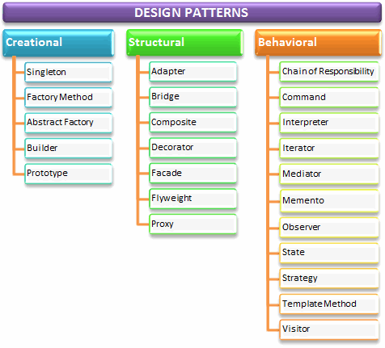

= 1.Seviye Başlık

Bu metin 1.seviye başlığın metnidir.

== 2.Seviye Başlık

Bu metin 2.seviye başlığın metnidir.

=== 3.Seviye Başlık

Bu metin 3.seviye başlığın metnidir.

.Numarasız Liste Örneği
* Linux şu anda başta IBM-PC uyumlu kişisel bilgisayarlar olmak üzere Apple, Atari ve Amiga gibi 68000 tabanlı bilgisayarlar üzerinde, Sun Sparc işlemcili iş istasyonları, Alpha işlemcili kişisel bilgisayarlar, MIPS, PowerPC, HP PA-RISC ve ARM mimarilerinde çalışmaktadır.
* IBM uyumlu kişisel bilgisayarlar üzerinde 80386 ve üzeri (80486 80586 Pentium PentiumPro ve türevleri) değişik üreticilerin işlemcileri ile sorunsuz olarak çalışmaktadır. 80286 ve 8086 işlemcili bilgisayarlar için sınırlı kabiliyette Linux uygulamaları mevcuttur.
* PCI, VESA, ISA ve MCA mimarilerinde her türlü anakartı desteklemektedir.

.Sıralı liste
. Teorik olarak 4 Gbyte'a kadar RAM desteklenmektedir.
. IDE-ATAPI CD-ROM sürücüleri, ve bazı özel CD-ROM kontrol kartları desteklenmektedir.
. Başta SoundBlaster, Gravis Ultrasound olmak üzere birçok ses kartı desteklenmektedir.

[NOTE]
====
BİLGİ BLOĞU
====

[IMPORTANT]
====
DİKKAT
====

[TIP]
====
İPUCU
====

= LINKLER
=== External Link
http://yapbenzet.kocaeli.edu.tr/[YapBenzet]

=== With spaces and special characters

link:++https://example.org/?q=[a b]++[URL with special characters]

=== Relative

link:sayfa.html[Döküman]

=== Link with attributes (Asciidoctor only)

https://discuss.asciidoctor.org[Discuss Asciidoctor,role=external,window=_blank]

=== Inline anchors

[#bookmark-b]#Inline anchors can be applied to a phrase like this one.#

=== Internal cross references

Nasıl video <<Video>> ekleneceğini öğrenin.

= Resimler 

=== Blok Resimler

=== Inline Resim

Click  to get the party started.

=== Inline image with positioning role
 Yazılım tasarım kalıpları.

= Video
[[video]]

== Blok Video

Video Ekleme Sırasında, video ismi yazılınca .adoc kapanmaktadır.

== Url İle Video

video::_r7i5X0rXJk[youtube]

= KAYNAK KOD

== Inline 

Reference code like `usingnamespacestd` or `methods` inline.

== Code block with title and syntax highlighting

.java
[source,java]
----
System.out.println()

----
== Linux Bash Script Kod
[source,linux]
----
chmod +x myscript.sh
ls -l myscript.sh
-rwxr-xr-x 1 alper alper May 10 21:12 myscript.sh
----

= Tablo

[%header,cols=2*] 
|===
|Ad
|Soyad

|Alper
|Çelik

|Alper1
|Çelik1
|===

== Internal Cross Reference

Link ile <<Video>> section'ına gidebilirsiniz.

= PLANTUML ÖRNEKLERİ

== CLASS DİYAGRAMI
[plantuml,sample2,png]
....
@startuml
Class11 <|.. Class12
Class13 --> Class14
Class15 ..> Class16
Class17 ..|> Class18
Class19 <--* Class20
@enduml
....

== USECASE DİYAGRAMI
[plantuml,sample,png]
....
@startuml
(First usecase)
(Another usecase) as (UC2)  
usecase UC3
usecase (Last\nusecase) as UC4
@enduml
....
